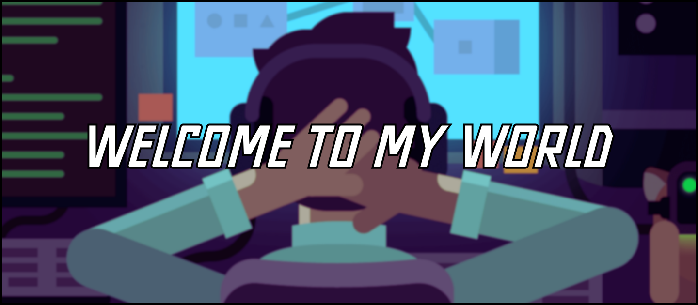

# 🎮 GameDev Experiments

## 🇬🇧 English:

Hello to you who's taking the time to read this, and welcome to my space for creative exploration.

I thought long and hard before creating this repo. Not because my projects are perfect, but precisely because they aren't, and that's what inspires me to move forward.
This repository is where I document my journey, my ideas, my tests, and my progress in game development.

I deeply believe that every project, even imperfect, is an opportunity to learn, experiment, and push my limits.
Whether in UEFN or other engines (Godot, UE5, etc.), I share here what excites me: creating, testing, understanding, and improving.

This isn't a portfolio of finished products, but a living logbook, driven by the desire to improve, build, and go further at every step.

---

## 🇫🇷 Français:

Salut à toi qui prends le temps de lire ça, et bienvenue dans mon espace d’exploration créative.

J’ai longtemps réfléchi avant de créer ce repo. Pas parce que mes projets sont parfaits, mais justement parce qu’ils ne le sont pas et c’est ça qui me donne envie d’avancer.
Ce dépôt, c’est l’endroit où je documente mon parcours, mes idées, mes tests, et ma progression dans le game development.

Je crois profondément que chaque projet, même imparfait, est une opportunité d’apprendre, d’expérimenter, et de repousser mes limites.
Que ce soit dans UEFN ou d'autres moteurs (Godot, UE5, etc), je partage ici ce qui me fait vibrer : créer, tester, comprendre, améliorer.

Ce n’est pas un portfolio de produits finis, mais un carnet de bord vivant, motivé par l’envie de m’améliorer, de construire, et d’aller plus loin à chaque étape.

---

## 📂 Projects

| 🧱 Game Engine | 🎮 Project Name        | 🧪 Status     | 💡 Description                                  | ⚙️ Tech     | 🔗 Access      |
|------------|-------------------------|------------|----------------------------------------------------------|-----------|-----------|
|**UEFN**| AquaBlasters🏄              | 🧪 Prototype  | Equip your surfboard and then go fight the other players    | Verse | [🔗 Lien](./[UEFN]AquaBlasters) |

*More projects coming soon...*

---

## 🧠 Why this repo exists

- To stay consistent and track my evolution as a game developer
- To embrace imperfection and make room for learning
- To think through systems, not just code

---

## 🛠️ Tools I use

| Tool / Engine | Purpose                                |
|---------------|----------------------------------------|
| UEFN / Verse  | Logic and level design in Fortnite     |
| Blender       | In apprenticeship          |
| Photoshop     | Create, modify assets/etc.     |

---

## 📬 Reach out

Feel free to connect via [LinkedIn](https://www.linkedin.com/in/shany-moreno-5a863b2aa) or open a discussion here.  
I'm always open to talk about experiments, design thinking, or wild gameplay ideas.

---
"*A dropout will beat a genius through hard work.*" 
**~Rock Lee** 

