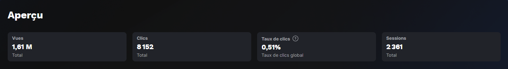

# 🏄 AquaBlasters

## 🇬🇧 English:

# Welcome to the world of AquaBlasters 🌊

**Hey there, thanks for taking the time to read this!**  
You're about to dive into the story of **AquaBlasters**, a project born from a desire to learn, create, and push my limits in the world of game development.

---

### 🌟 What is AquaBlasters?

**AquaBlasters is a prototype game developed in UEFN (Unreal Editor for Fortnite).**  
For those unfamiliar, **UEFN** is a streamlined version of **Unreal Engine 5**, tailored to Fortnite's ecosystem. No C++ here, but two main options:
- Prebuilt **“devices”** (configurable no-code tools)
- Or **Verse**, a scripting language built specifically for UEFN

I quickly leaned toward **Verse** for its flexibility, better performance, and creative freedom.

**The original concept?**  
Two teams — **Sharks** and **Octopus** — face off on surfboards in random themed maps.  
Players first spawn in a closed-off island **lobby** where they gear up, then enter a **portal** that drops them on their **surfboard**.  
A **random number generator** picks the map during the server instance initialization, activating only the corresponding teleporters.

---

## 🛠️ From Experiment to Real Project

Originally, AquaBlasters had **no roadmap**.  
It was just a simple idea — a way to explore UEFN and Unreal Engine 5.

But as I dove deeper, it quickly took over **more time than expected**.  
I even had to **change project mid-deadline**, which impacted my journey at **42**.  
Between **moving countries** and juggling studies with this side project, I had to catch up fast…  
but honestly? **I loved it.**

I realized I perform **best under pressure**.  
And this project is **proof** of that.

---

### ⚙️ Major Challenges (aka learning opportunities):

- 🔄 **Complete gameplay rework** after 1–2 weeks: the initial idea wasn't deep enough.
- 🌀 **Lobby redesign**: it became too repetitive and suffocating in terms of replayability.
- ⛔ **Critical launch bug**: if a player joined mid-game, it triggered a restart of the entire gameloop for everyone.  
The issue came from using **no-code timers improperly**. I had to debug the entire system… on the road, at my in-laws' place 😅.
- 🛠️ **Gradual shift to Verse scripting**: to gain full control, boost performance, and avoid no-code pitfalls.
- 🏄‍♂️ **Unresolved bug at launch**: players could **lose their surfboard after a high-speed collision**.  
I didn’t fix it due to time constraints, but I now know how I’d handle it — by **saving the player's position** and **teleporting a new board under them**.

---

### 📊 And despite all that… the stats!

**On August 29, 2024**, I published the experience.  
By **August 30**:
- 👥 **921 active players**
- 📺 **244,603 total views**
- 🖱️ **2,874 people clicked the thumbnail**
- 🎮 **987 play sessions**

And all of that, **with a broken gameloop** 🤯  
It’s wild how far a prototype — with **zero ambition to succeed** — can go.

---

### 🎯 Key takeaways:

**Testing is everything.**  
I now use **multiple accounts** to simulate complex test cases and make debugging more efficient.

**Everything is possible.**  
Even a random experiment can open doors.  
This project gave me a moment of clarity:

> **Everything is within reach — you just have to reach out and never let go.**

---

### 🎓 In conclusion

This project taught me a lot — about **tech**, yes, but also about **myself**.  
One of my biggest challenges? **Still being a student**, torn between:
- school obligations
- personal projects
- moving
- and trying to **pay rent**

---

But this is just the beginning.  
**If you’re reading this, you’re now part of the journey too.**  
**Thanks for being here.** 🙏

---

## 🇫🇷 Français:

# Bienvenue dans l’univers d’AquaBlasters 🌊

**Salut à toi qui prends le temps de lire ces lignes !**  
Ici commence l’histoire d’**AquaBlasters**, un projet né de l’envie d’apprendre, de créer, et de repousser mes limites dans l’univers du game development.

---

### 🌟 C’est quoi AquaBlasters ?

**AquaBlasters**, c’est un prototype de jeu conçu dans **UEFN** (*Unreal Editor for Fortnite*).  
Pour ceux qui ne connaissent pas, **UEFN** est une version simplifiée d’**Unreal Engine 5**, adaptée à l’univers de Fortnite.  
Pas de **C++**, mais deux possibilités :
- des **"appareils"** (*no-code* configurables)  
- ou **Verse**, un langage conçu spécialement pour UEFN

J’ai très vite choisi **Verse**, car il offre bien plus de **liberté**, de **performance**, et de **contrôle**.

**L’idée initiale ?**  
Deux équipes — **Sharks** et **Octopus** — s’affrontent sur des **planches de surf** dans des **cartes thématiques aléatoires**.  
Les joueurs apparaissent d’abord dans un **lobby fermé**, où ils s’équipent d’armes, puis empruntent un **portail** pour rejoindre leur planche de surf.  
Le choix de la carte est **tiré aléatoirement** au moment de l’instanciation du serveur.

---

## 🛠️ Un projet expérimental… qui a pris de l’ampleur

À la base, AquaBlasters n’avait **aucune feuille de route**.  
C’était une simple idée, un **prétexte pour découvrir** UEFN et UE5.

Mais rapidement, ce projet a pris une place **inattendue** dans mon quotidien.  
Il m’a même bloqué **2-3 mois**, car j’ai changé de projet en pleine **"deadline"**, ce qui a eu un impact sur mon parcours à **42**.  
Entre un **déménagement à l’étranger** et la charge du cursus, j’ai dû rattraper mon retard… mais au final, **j’ai aimé ça**.

J’ai compris que **je donne le meilleur de moi-même sous pression**.  
Ce projet en est **la preuve**.

---

### ⚙️ Les galères (aka apprentissages) majeures :

- 🔄 **Refonte complète du gameplay** après 1–2 semaines : l’idée initiale n'était pas assez solide.
- 🌀 **Refonte du lobby**, trop étouffant et peu rejouable.
- ⛔ **Bug critique à la sortie** : un joueur qui se connectait en cours de partie relançait toute la gameloop !  
Ce problème venait d’un usage **mal configuré des timers en no-code**.  
J’ai dû tout redébugger… **depuis chez mes beaux-parents, sur la route** 😅.
- 🛠️ **Transition progressive vers Verse** : pour plus de **contrôle**, de **stabilité** et de **performance**.
- 🏄‍♂️ **Bug non corrigé à la sortie** : la planche de surf **disparaissait** si le joueur subissait un **choc trop brutal**.  
Je sais comment corriger ça désormais, mais **j’avais déjà atteint ma limite de temps** à ce moment-là.

---

### 📊 Et malgré tout ça… les chiffres !

**Le 29 août 2024**, j’ai publié l’expérience.  
**Le 30 août** :
- 👥 **921 joueurs actifs**
- 📺 **244 603 vues**
- 🖱️ **2 874 clics sur la vignette**
- 🎮 **987 sessions jouées**

Et tout ça, alors que **la gameloop était… cassée** 🤯  
Comme quoi, même un **prototype sans ambition de réussite** peut attirer l’attention.

---

### 🎯 Leçons tirées :

**Tester, toujours tester.**  
J’ai créé **plusieurs comptes** pour simuler des connexions multiples et améliorer mes process de debug.

**Tout est possible.**  
Ce projet, que je considère comme un **simple prototype**, m’a montré que le **potentiel est réel**.  
Il suffit de **s’engager à fond**.

> **Aujourd’hui, je poursuis mon cursus à 42. Et pour être honnête :**  
> J’ai la rage d’apprendre.  
> Je veux **créer**, **comprendre**, et **me spécialiser** —  
> dans le **game dev** que je porte dans le cœur,  
> comme dans la **cybersécurité** qui m’attire professionnellement.

---

### 🎓 En conclusion

Ce projet m’a appris **énormément**, mais il m’a aussi montré **mes limites**.  
L’une des plus grosses ? **Être encore étudiant**, jonglant entre :
- études
- projets persos
- déménagement
- et **recherche d’un job** pour payer mon loyer

---

Mais ce n’est que le début.  
Et si tu lis ça, **c’est que tu fais un bout du chemin avec moi**.  
**Merci. 🙏**

---

## 📸 Screenshots

### 🔹 Game World

*The lobby where teams prepare before launching into battle.*

*Combat on water, with unique movement and verticality.*

---

### 🔹 Statistics (Launch Day)

  
*A snapshot from August 30, 2024.*---  

- 👥 **921 Active Players**
- 📈 **244,603 Impressions**
- 🎯 **2,874 Thumbnail Clicks**
- 🎮 **987 Sessions** (with a broken gameloop!)
